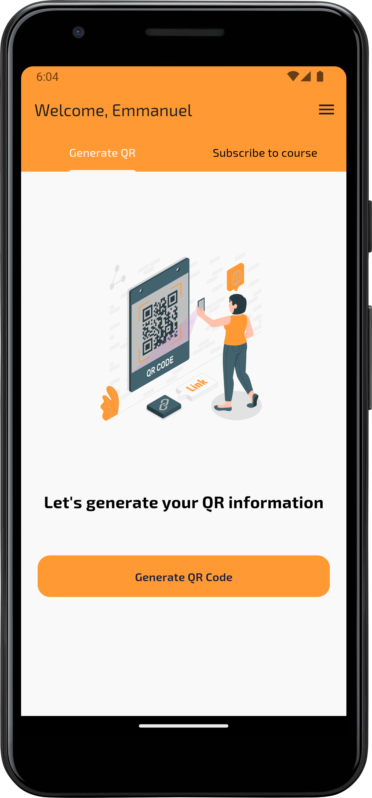
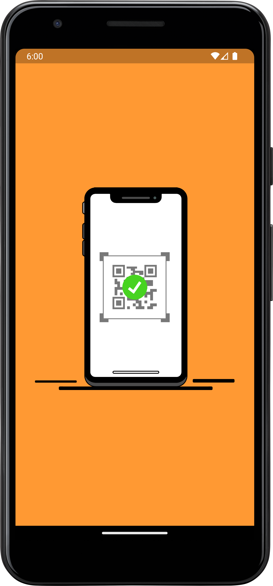
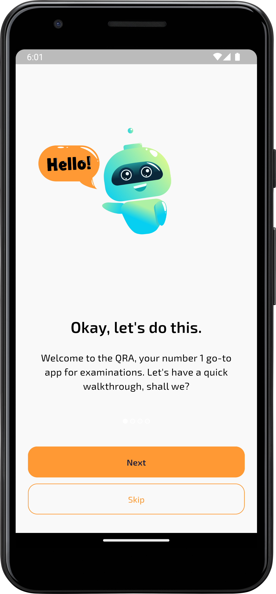
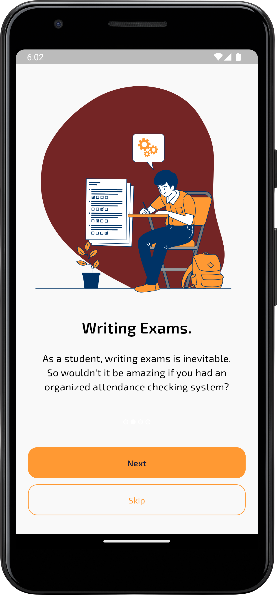
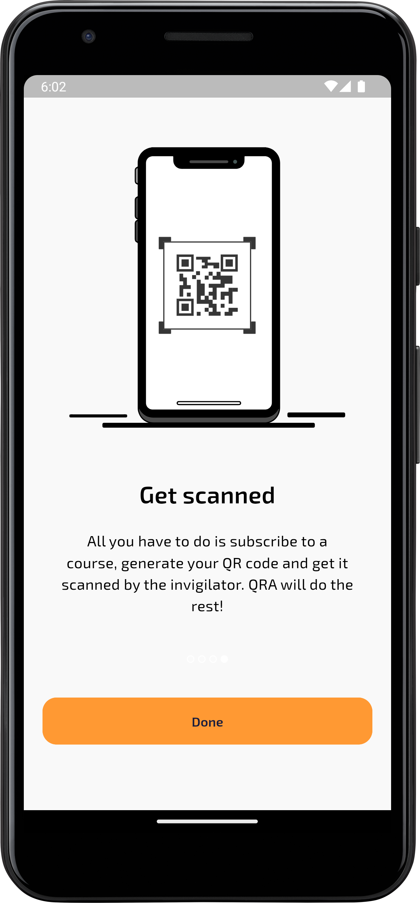
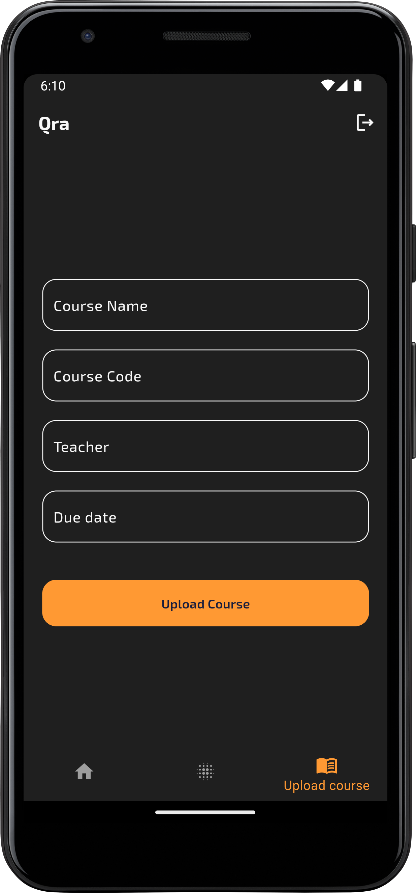
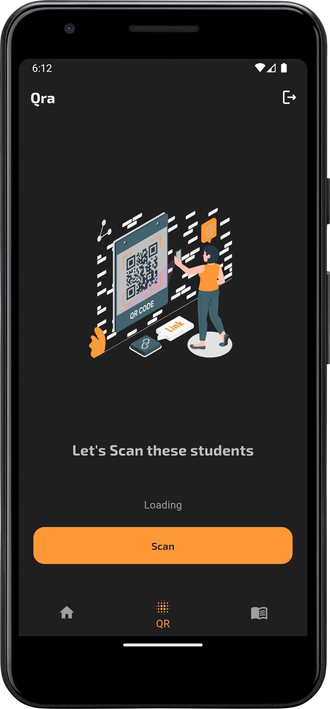

# qra

QRA is a QR attendance-taking app that utilizes QR codes for secure and efficient attendance management. This app aims to streamline the process of recording attendance by integrating QR code scanning. It's usecase is for a examination attendance in VVU, Ghana.

# Features
- QR Code Scanning: Easily mark attendance by scanning QR codes.
- Cross-Platform: Developed with Flutter, making it available for both Android and iOS devices.
- User-Friendly Interface: Simple and intuitive design for easy navigation. Desinged for both light and dark mode

## Some Screenshots

### Home Screen as a student

### Some Intro screens

### Upload a course (as a lecturer) || Dark mode

### Scan students to take attendance (as a lecturer)

